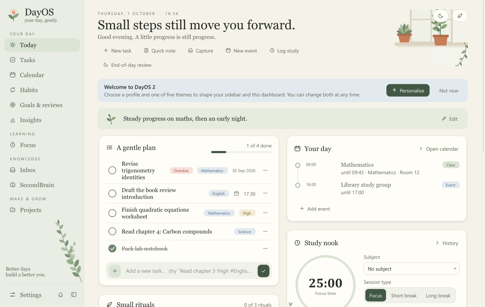
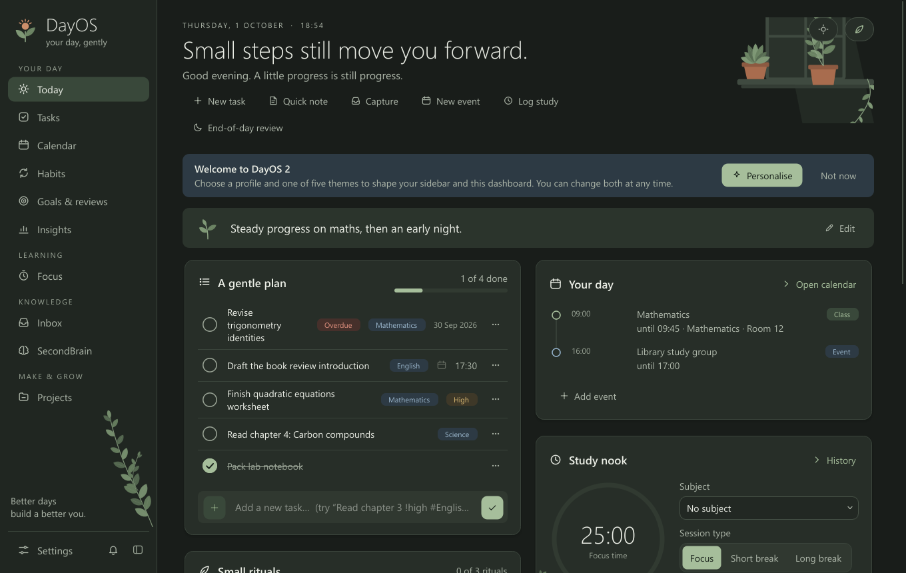
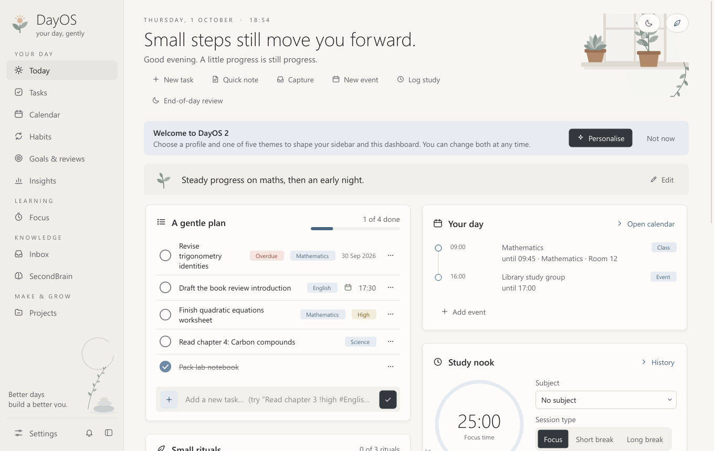
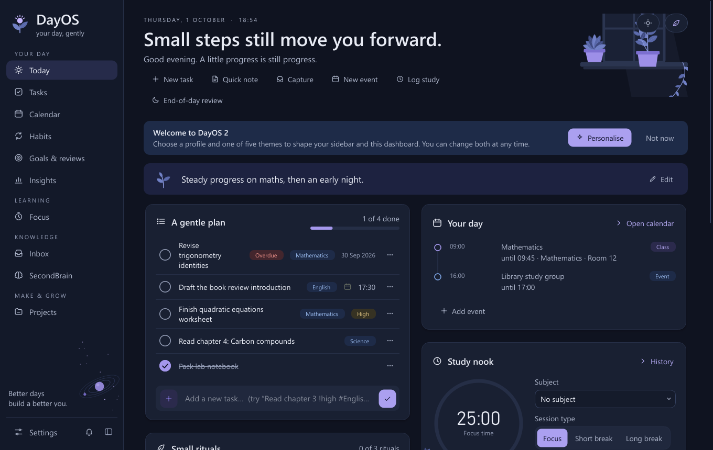
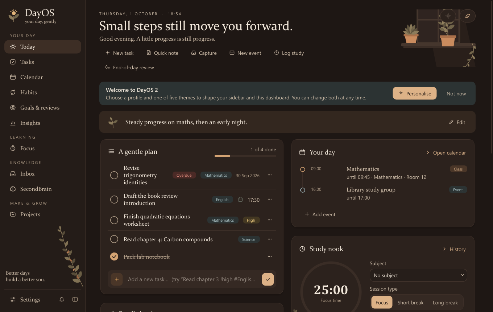

# DayOS

**A calm, local-first personal desktop ecosystem for Windows 10/11** — your day,
your learning, your knowledge and your desktop tools in one quiet app. Made by
**ETC Labs**.

Everything is stored on your own computer in one SQLite database. No account, no
telemetry, no ads. Every core feature works offline; the few online extras
(weather, news, GitHub, AI) are off until you turn them on.



<sub>Screenshots use example data. A fresh DayOS starts empty and never invents tasks, results, headlines or weather.</sub>

---

## Download and run (no installation, no Python needed)

1. Download **`DayOS.exe`** from the [latest release](../../releases/latest).
2. Put it in a folder you can write to — for example `D:\Apps\DayOS\` or `Documents\DayOS\`.
3. Double-click `DayOS.exe`.

DayOS is a single portable Windows executable that carries its own Python runtime
and Qt libraries, so you **don't need Python, VS Code or anything else**.

* **Requires:** Windows 10 or 11, 64-bit (x64).
* **First launch** takes a few seconds. The EXE isn't code-signed, so SmartScreen may
  show "Windows protected your PC" — choose **More info → Run anyway** if you trust the download.
* **Updating from 1.x:** replace `DayOS.exe`. Your `DayOS Data` folder is kept; before the
  database is upgraded DayOS writes a verified backup (`backups\…-pre-upgrade-v1-to-v8.db`).

Where your data lives, backups, recovery and privacy: **[docs/DATA_AND_PRIVACY.md](docs/DATA_AND_PRIVACY.md)**.

---

## What's inside

| Group | Module | What it does |
|---|---|---|
| Your day | **Today** | Dashboard: plan, schedule, focus timer, habits, coming up, workload check, inbox, revision due, review — plus optional weather, news, projects and money widgets. Profile-based quick actions. |
| | **Tasks** | Due dates and times, priorities, tags, projects, checklists, repeating tasks, "waiting on" dependencies, estimates vs actual time, links to notes, undo. |
| | **Calendar** | Day, week, month and timetable views; repeating events (skip / end series); reminders; conflict warnings. |
| | **Habits** | Flexible schedules, reminders, weekly targets, morning and evening routines. |
| | **Goals & reviews** | Goals with milestones, journal, daily and weekly reviews. |
| | **Insights** | Charts counted only from your own records. |
| Learning | **Focus** | Pomodoro presets, custom lengths, break reminders, sessions linked to tasks, projects or StudyForge topics, notes, accurate timing. |
| | **StudyForge** | Courses as trees, local PDF/Word/text import with review, CBSE Class 10 starter (chapter lists marked provisional), question bank with provenance, blueprints, generated tests, timed test taking with autosave/resume, marking (auto + rubric self-marking), spaced revision with reasons, mistake notebook, flashcards, materials, fair analytics. |
| | **Exams** | v1 exams, chapters, mistakes and mock tests (kept). |
| Knowledge | **Inbox** | Everything captured quickly (Ctrl+Shift+Space, or a system-wide shortcut), ready to sort. |
| | **SecondBrain** | Notes, bookmarks, code snippets, terminal commands, ideas, troubleshooting and study notes; Markdown preview; collections; `[[wiki links]]` and backlinks; attachments; Markdown import/export. |
| Make & grow | **Projects** | Milestones, tasks, logs, changelog, release notes, time, links; optional read-only GitHub panel. |
| | **Skills** | Roadmaps with milestones, prerequisites, resources, practice, evidence; weekly look back (no scores). |
| Life | **Briefing** | Optional weather (Open-Meteo) and a quiet news briefing from publishers' RSS feeds. |
| | **Money** | Manual income/expense tracker, budgets, savings goals, subscriptions with renewal reminders, CSV export. |
| Desktop tools | **ClipVault** | Opt-in clipboard history with privacy filters, pause, retention, snippets and templates. |
| | **FilePilot** | Read-only scans, true duplicates (SHA-256), large files, old downloads; previewed, recorded, undoable moves and Recycle Bin. |
| | **AudioDock** | Microphones and speakers, default-device switching (verified), volume/mute, microphone check, recording and meeting profiles. |

**Everywhere:** Ctrl+K command palette with search across modules, quick capture,
reminders with snooze and quiet hours, profiles (school, college, self-learner,
developer, professional, creator, general) that choose modules and widgets, five
themes, reduced motion, text size, and optional AI suggestions (your own key,
consent before every request).

Which sidebar entries you see depends on your profile; turn modules on or off in
**Settings → Profile & layout**.

### Five themes

| Paper & Sage (default) | Midnight Focus | Zen Minimal |
|---|---|---|
|  |  |  |

| Aurora | Espresso |
|---|---|
|  |  |

Each theme has its own palette, type, shape and illustrations; all meet text
contrast checks. Accent colours and text size are adjustable; **Settings →
Appearance → Reduce motion** removes animations. Details: [docs/THEMES.md](docs/THEMES.md).

### Keyboard

| Keys | Action |
|---|---|
| `Ctrl+K` | Command palette and search |
| `Ctrl+Shift+Space` | Quick capture (system-wide shortcut configurable, default `Ctrl+Alt+N`) |
| `Ctrl+1` … `Ctrl+9`, `Ctrl+,` | Go to a page, Settings |
| `Ctrl+N` / `Ctrl+F` | New item / search on the current page |
| `Ctrl+S` / `Ctrl+E` | Save note now / Markdown preview (SecondBrain) |
| `Ctrl+B` | Collapse the sidebar |
| `F1` | All shortcuts |

---

## Troubleshooting

* **It closes or nothing happens:** read `DayOS Data\logs\dayos.log` next to the EXE, or run
  `DayOS.exe --debug` from a Command Prompt.
* **"Where should DayOS keep your data?"** — the EXE's folder isn't writable; pick a location
  or move the EXE to a folder you own.
* **End-to-end check** against a throwaway folder:
  ```bat
  set DAYOS_HOME=%TEMP%\dayos-check
  DayOS.exe --self-test write
  DayOS.exe --self-test verify
  ```
* **Database health:** Settings → Data & backups → *Check database health*.

## Develop, test and build

See **[docs/DEVELOPMENT.md](docs/DEVELOPMENT.md)** (setup, tests, build, release) and
**[docs/ARCHITECTURE.md](docs/ARCHITECTURE.md)** (modules, database, migrations).
Current status and next steps: [PROJECT_STATUS.md](PROJECT_STATUS.md).

## Version

**2.0.0** — DayOS v2: modular ecosystem, five themes, StudyForge, SecondBrain,
ClipVault, FilePilot, AudioDock, briefing, money, skills, projects, optional AI.

## Known limitations

* The EXE isn't code-signed (SmartScreen warns on first run).
* Online features depend on third-party services: Open-Meteo, publishers' RSS feeds, GitHub, and
  your AI provider. They're optional and DayOS keeps working when they're unavailable.
* AI features were tested with a simulated provider only; no real API key was available while
  building this release.
* AudioDock: switching the default device uses Windows' undocumented `IPolicyConfig` interface
  (the one the Sound control panel uses) and checks the result; the microphone meter was tested
  with a simulated driver (DayOS never opened the microphone during automated testing).
* ClipVault's sensitive-content detection is a helpful filter, not a guarantee — pause it before
  copying secrets.
* CBSE chapter lists are a provisional starter; check them against the current official syllabus.
* Tested on Windows 10 Pro (x64) at one display scale.
