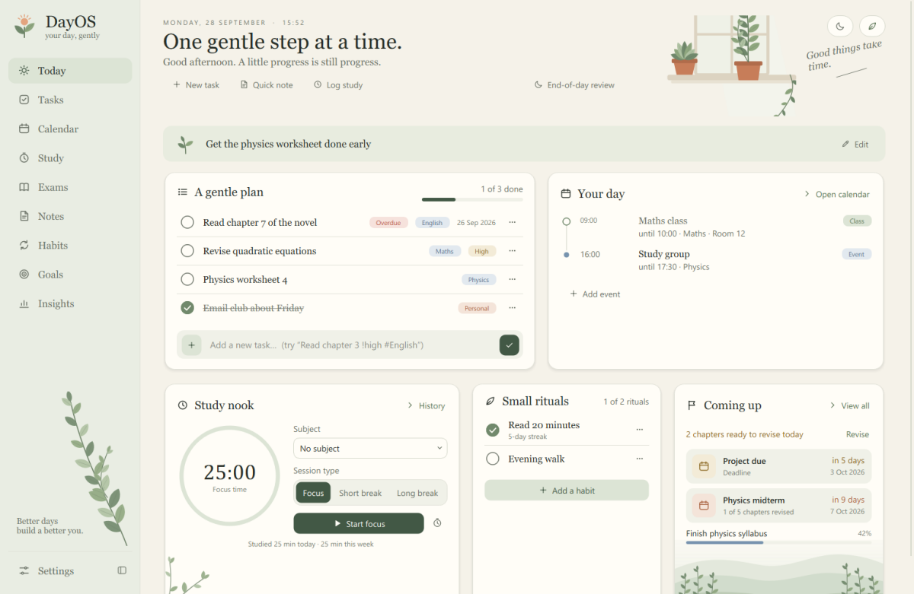
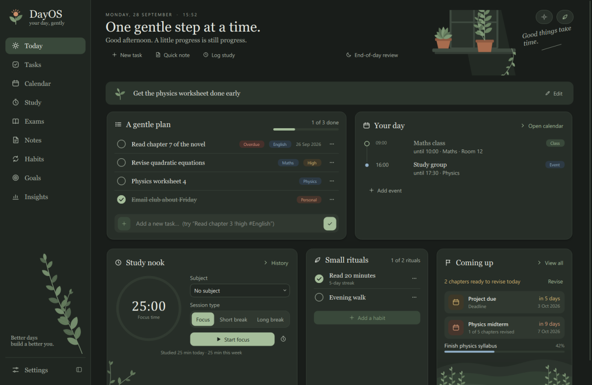
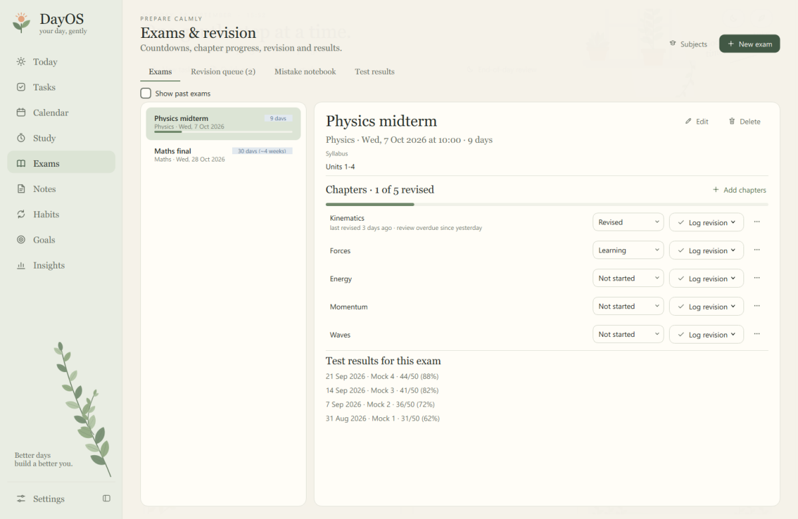

# DayOS

**A cozy, local-first daily companion for students** — a gentle plan for the day,
your schedule, a focus timer, exams and revision, notes, habits, goals and quiet
insights. Made by **ETC Labs** for Windows 10/11.

Everything stays on your own computer in one small SQLite file. No account, no
cloud, no telemetry, no ads, no paid APIs — every feature works offline.



<sub>Screenshots use example data. A fresh DayOS starts empty and never invents tasks, habits or statistics.</sub>

---

## Download and run (no installation, no Python needed)

1. Download **`DayOS.exe`** from the [latest release](../../releases/latest).
2. Put it in a folder you can write to — for example `G:\Apps\DayOS\` or `Documents\DayOS\`.
3. Double-click `DayOS.exe`.

That's it: DayOS is a single, portable Windows executable. It includes its own
Python runtime and Qt libraries, so you **don't need Python, VS Code or anything
else installed**. There's no installer and nothing is written to the registry
(unless you turn on *Open at sign-in* in Settings).

* **Requires:** Windows 10 or 11, 64-bit (x64).
* **First launch** takes a few seconds while Windows checks the file. Because
  the EXE isn't code-signed, SmartScreen may show "Windows protected your PC" —
  choose **More info → Run anyway** if you trust the download.
* **Updating:** replace `DayOS.exe` with the new version. Your data folder is
  separate from the EXE and is kept.

### Where your data lives

DayOS creates a **`DayOS Data`** folder next to `DayOS.exe`:

```
G:\Apps\DayOS\
├── DayOS.exe
└── DayOS Data\
    ├── data\dayos.db     ← all your tasks, notes, habits, study time …
    ├── backups\          ← backups you make (never deleted automatically)
    ├── exports\          ← JSON / CSV exports
    └── logs\dayos.log    ← technical log (no note or task contents)
```

* If the EXE's folder isn't writable (for example inside *Program Files*), DayOS
  asks where to keep data: your Windows user folder
  (`%LOCALAPPDATA%\ETC Labs\DayOS`) or any folder you choose. It remembers the
  choice. DayOS never moves your data silently.
* Advanced: set the `DAYOS_HOME` environment variable to use a specific folder.
* The app unpacks its program files to a private temporary folder while it runs
  (standard for single-file apps) and removes them when you close it. Your data
  is never stored there.

### Backups, export and restore

* **Settings → Backups → Back up now** writes a verified snapshot to `backups\`.
  DayOS also makes an automatic safety backup before an upgrade, a restore or an import.
* **Restore…** validates the chosen backup, shows what it contains and asks before replacing anything.
* **Export JSON** saves everything (and can be imported back); **Export CSV** gives spreadsheet-friendly files.
* Manual backup: close DayOS and copy the whole `DayOS Data` folder somewhere safe.

---

## Features

| Area | What you can do |
|---|---|
| **Today** | Date, a gentle daily headline and greeting; an editable daily intention; *A gentle plan* (today's and overdue tasks with animated completion and progress, quick add); *Your day* timeline of classes, events and exams; *Study nook* focus timer; *Small rituals* habit checklist; *Coming up* exams, deadlines and goals with countdowns; quick note, study log and end-of-day review. |
| **Tasks** | Create, edit, complete, reopen, delete (confirmation **and** Undo); due date/time, priority, subject, category, goal, estimate, checklist; filters, search, sorting; quick add understands `tomorrow`, weekdays, `!high`, `!low`, `#category`. |
| **Calendar** | Month, week and weekly-timetable views; events and deadlines; repeating classes (skip one day, end or delete a series); overlap warnings; exams and task due dates shown automatically. |
| **Study nook** | Focus / short / long break timer with accurate timing (minimising or sleeping the PC doesn't distort it); sessions saved exactly once; interrupted sessions offered on next launch; manual logging, history and weekly chart. |
| **Exams** | Subjects, exams with countdowns, chapter status, a simple transparent revision schedule and queue, mistake notebook, mock-test results with a score chart. |
| **Notes** | Plain-text notes with tags, pinning and search; autosave with clear *Saved* status; nothing is lost when you switch pages or close DayOS. |
| **Habits** | Daily or chosen weekdays, streaks, weekly and 30-day rates, a 12-week history you can correct by clicking. |
| **Goals & journal** | Measurable or open goals with progress history and linked tasks; your daily intentions and reviews. |
| **Insights** | 7 / 30 / 90-day and 12-month views of tasks, study time, habits, tests and goals — counted from your records, no scores or rankings. |
| **Settings** | Light (default) / dark / system theme, your name, week start, 12/24-hour clock, date format, timer lengths, reduce motion, optional notifications and launch at sign-in, backups, export/import, health check, shortcuts. |

### Design

A warm cream-and-sage light theme (the default) and a coordinated warm dark
theme, editorial Georgia headings, and small original botanical illustrations.
Motion is quiet and quick (150–300 ms): pages cross-fade, the sidebar selection
glides, cards lift slightly on hover, checks draw themselves, progress bars
glide, dialogs and confirmations fade in, and the whole window cross-fades when
you switch themes. **Settings → Reduce motion** (or turning off animations in
Windows) removes it.

| Dark theme | Exams & revision |
|---|---|
|  |  |

### Keyboard shortcuts

| Keys | Action |
|---|---|
| `Ctrl+1` … `Ctrl+9` | Today, Tasks, Calendar, Study, Exams, Notes, Habits, Goals, Insights |
| `Ctrl+,` | Settings |
| `Ctrl+N` / `Ctrl+F` | New item / search on the current page |
| `Ctrl+Shift+T` / `Ctrl+Shift+N` | Quick task / quick note from anywhere |
| `Ctrl+S` | Save the current note now |
| `Ctrl+B` | Collapse / expand the sidebar |
| `F5` / `F1` | Refresh page / show shortcuts |
| Tasks: `↑` `↓` `Space` `Enter` `Delete` | Move, complete, edit, delete |
| Study: `Ctrl+Enter` | Start / pause the timer |
| `Tab` | Move between controls (focus rings appear for keyboard use) |

---

## Troubleshooting

* **Nothing happens / it closes immediately:** look at `DayOS Data\logs\dayos.log`
  next to the EXE. For more detail, start it from a Command Prompt with
  `DayOS.exe --debug`.
* **"Where should DayOS keep your data?"** appears: the EXE's folder isn't
  writable. Pick one of the offered locations, or move `DayOS.exe` to a folder
  you own.
* **Check the installation works:** in a Command Prompt, run the built-in
  end-to-end check against a *throwaway* folder (it creates test records there):
  ```bat
  set DAYOS_HOME=%TEMP%\dayos-check
  DayOS.exe --self-test write
  DayOS.exe --self-test verify
  ```
  Results are written to `%TEMP%\dayos-check\selftest.json`.
* **Database health:** Settings → Backups → *Check database health*.

---

## Develop from source

Requires Python 3.12 (developed with 3.12.10) and `PySide6-Essentials 6.11.2`.

```bash
py -3.12 -m venv .venv
```

```bash
.venv\Scripts\python.exe -m pip install -r requirements.txt
```

```bash
.venv\Scripts\python.exe main.py
```

When running from source, data lives in the project folder (`data\`, `backups\`, `logs\`).

**Tests** (87, using throwaway databases under `tests\.tmp\`; UI tests run offscreen):

```bash
.venv\Scripts\python.exe -m unittest discover -s tests -t .
```

**Build the EXE** (installs nothing globally; caches stay inside the project):

```bash
.venv\Scripts\python.exe -m pip install -r requirements-build.txt
```

```bash
powershell -ExecutionPolicy Bypass -File .\build.ps1
```

Output: `dist\DayOS.exe` (≈26 MB, x64, windowed). `-ExecutionPolicy Bypass`
applies only to that one command. `tools\make_art.py` regenerates the
botanical SVGs and `tools\make_icon.py` the icon.

### Architecture

```
main.py                 entry point (--smoke-test, --self-test, --debug)
src/app.py              start-up: data folder, logging, error handling, theme, window
src/config.py           data-folder rules (source vs portable EXE vs DAYOS_HOME)
src/database/           SQLite connection, schema and versioned migrations
src/repositories/       all SQL (parameterised) and validation
src/services/           dates, streaks, revision rule, stats, timer, backup, export
src/ui/theme.py         colour tokens (light/dark) and the generated stylesheet
src/ui/anim.py          shared motion helpers (durations, easing, reduced motion)
src/ui/widgets/         cards, animated buttons, checks, charts, nav, botanical art
src/ui/pages/           today, tasks, calendar, study, exams, notes, habits, goals, insights, settings
assets/art/             original SVG illustrations (generated by tools/make_art.py)
tests/                  unittest suite
```

---

## Version

**1.1.0** — botanical redesign, motion system, single-file Windows release.
See [DEVLOG.md](DEVLOG.md) for history.

## Known limitations

* The EXE is not code-signed, so SmartScreen may warn on first run.
* Single-file start-up unpacks ~67 MB to a temporary folder on each launch; on
  this development PC the window appeared in about 3 s (measured 3.0–3.3 s).
* *Open at sign-in* and Windows notifications are implemented but were not
  exercised end-to-end during development (both are off by default).
* Events can't cross midnight; editing a weekly class changes every week (single days can be skipped).
* Notes are plain text. JSON import replaces all data (no merge).
* Tested on Windows 10 Pro (x64) at one display scale.
